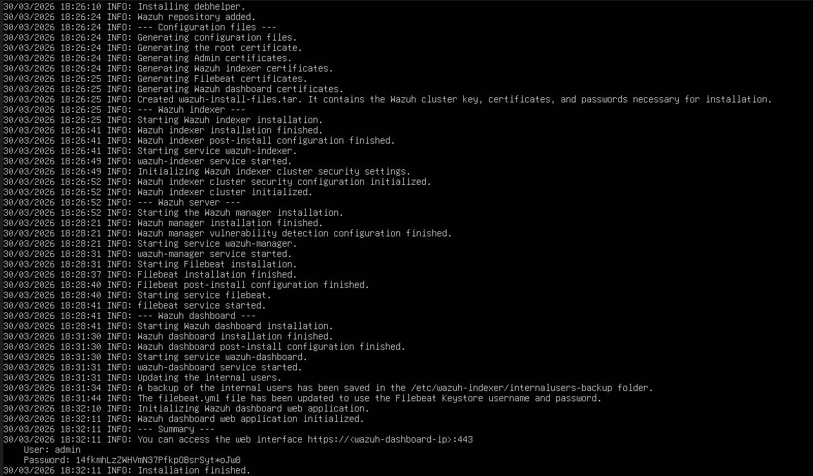
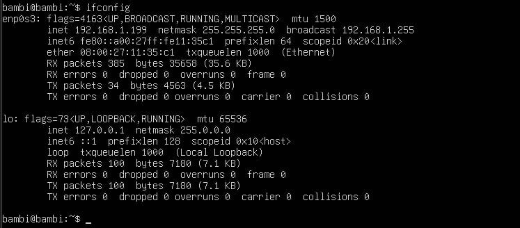
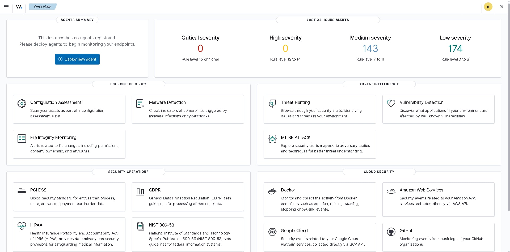
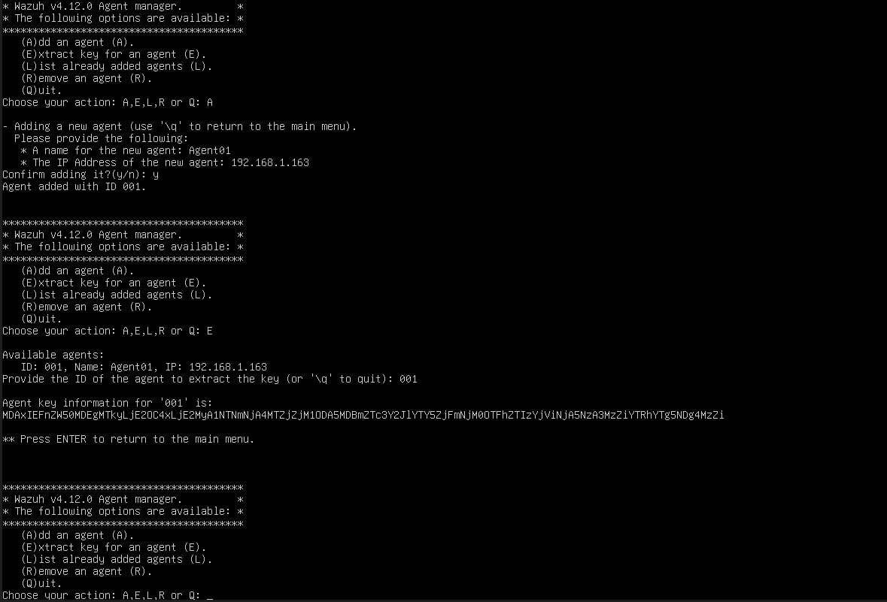
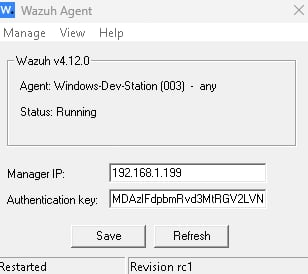
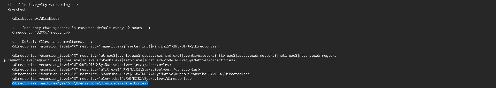
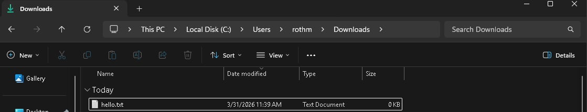
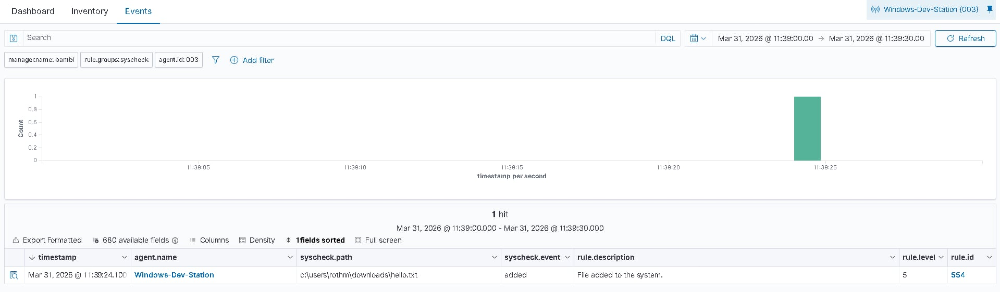
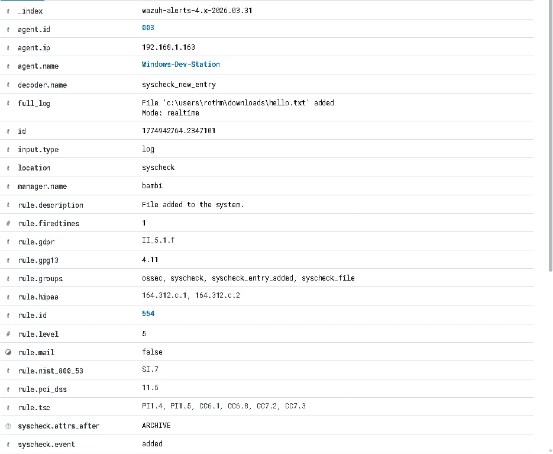
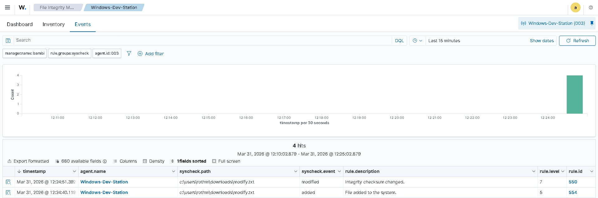

# 🛡️ Wazuh SIEM Lab – File Integrity Monitoring

> Hands-on lab that was created as part of my journey of learning.

---

## 📌 Project Overview

This project documents the implementation and configuration that was done in Wazuh. **Wazuh** is an open source SIEM platform. In this project, I've primarily focused on setting up **File Integrity Monitoring (FIM)** which is a detection capability that can be used to identify unauthorized changes to system files, or randomly added files that weren't known by the user.

In this lab, I've learned what kind of monitoring can popup using FIM and how alerts work between the **Host**, **Wazuh**, and **Server**. 

---

## 🎯 Objectives

- Install Wazuh in a home lab environment (Ubuntu)
- Configure the Wazuh Agent
- Enable and Customize File Integrity Monitoring (FIM) for specific folder.
- Trigger and Observe Real-Time alerts from file created, deleted, and modified.
- Understand how FIM relates or correlates to real-world threat detections.

---

## 🧰 Tools & Technologies

| Tool | Purpose |
|------|---------|
| **Wazuh** | Open-source SIEM platform |
| **Wazuh Manager** | Central server for collecting and analyzing logs |
| **Wazuh Agent** | Installed on monitored endpoint |
| **Wazuh Dashboard** | Web UI for visualizing alerts and events |
| **VirtualBox / VMware** | Virtualization for lab environment |
| **Linux / Windows** | Operating systems used for endpoints |

---

## 🔧 Setup

### Step 1: Installation of Wazuh

> Wazuh Manager installation terminal output
> 

Wazuh was installed through the process of Wazuh documentation. This is the entire package for the SIEM, receiving logs, events, dashboards, and agents.

---

### Step 2: Checking Network Address to access the Dashboard

> Wazuh Dashboard Process Access
> 

Once it is installed, logins was given and then needed to identify the Address to access the dashboard via browser. This is where you will get your starting to accessing it.

---

### Step 3: Accessing the Dashboard

> Main Page of Wazuh Dashboard
> 

After accessing the Dashboard, this is where everything is monitored. Main interface to monitor events, review alerts, and investigate incidents.

---

### Step 4: Setting up Wazuh Agent

> Wazuh Agent Configuration
> 
> 

This is where I started managing the Wazuh Agent and creating one so that we can monitor what is happening on the Host Operating System.

---

### Step 5: Configuring FIM to specific folder

> FIM Configuration 
> 

This is where we will configure the FIM to a specific folder to easily monitor if a file has been created, deleted, and modified.

---

### Step 6: Creating a txt file to assigned folder

> FIM Testing 
> 

This is where we will create a text file to see if it has successfully worked and to see what alert will popup.

---

### Step 7: Results of FIM

> FIM Results
> 

In the FIM Events, we can see that a file has been created in the folder.

---

### Step 8: Additional Properties

> FIM Additional
> 

This is where we will see the additional information, we can see the file path, description, and the timestamp.

---

### Step 9: Modify Alert

> FIM Results
> 

This shows that even modified files can be detected.

---

## 🔍 Key Concepts Learned

- **SIEM architecture** — How managers, agents, and dashboards interact.
- **Log ingestion and analysis** — How raw system events become security alerts.
- **File Integrity Monitoring** — Detecting files added, modified, and deleted.
- **Alert triage** — Learning, Reading and Interpreting Wazuh alerts the way a SOC analyst would.

---
